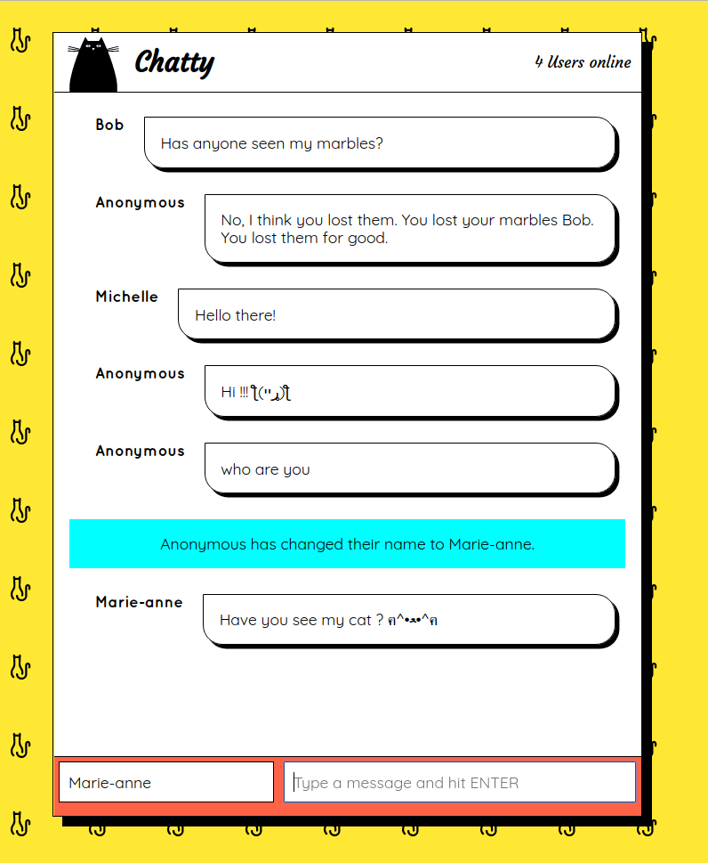
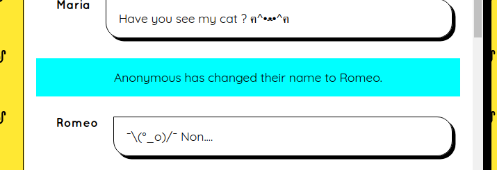
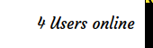

# Chatty App

First real time web application to appreciate and understand what goes into making an app like Slack. Build with React, Babel, SocketServer and WebPack.

## Final Product
#### First page App

#### When you change your username

#### keep track to the users

## Getting Started

1. Fork this repository, then clone your fork of this repository.
2. Install dependencies using the `npm install` command.
3. Start the react project using the `npm start` command. The app will be served at <http://localhost:3000/>.
4.In on other terminal, go on the chatty_server folder(/chatty_server) `npm install` command.
5. Start the chatty server using the `npm start` command. The app will be served at <http://localhost:3001/>.
6. to see the app, go to <http://localhost:3000/> in your browser.

## Dependencies

- For the App:
  - react
  - react-dom

- For the chatty server:
  - express
  - uuid
  - ws